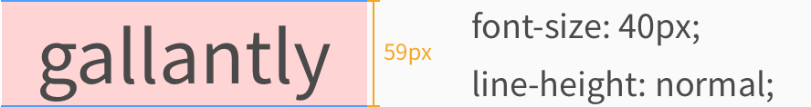
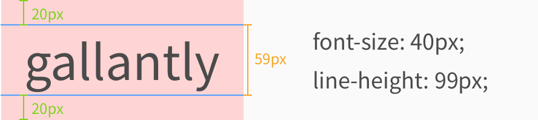
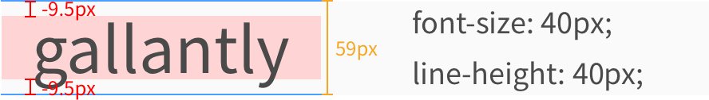

line-height를 사용하면 줄간격을 조절할 수 있습니다. 사실 line-height 속성을 '완벽하게' 이해하려면 타이포그래피 지식이 조금 필요한데요. 우선은 아주 간단하게만 설명드리겠습니다.





위 사진에 파란 줄 보이시죠? 이 파란 줄 사이가 실제 내용이 들어가 있는 'content area'(콘텐츠 영역)입니다. font-family와 font-size에 따라서 'content area'가 정해지고, line-height는 'content area'에 영향을 주지 않습니다.

line-height를 통해서는 각 줄이 실질적으로 차지하는 공간을 정해줄 수 있습니다. 예를 들어서 99px로 설정하면 'content area'보다 40px이 많기 때문에 위 아래로 20px의 공간이 추가로 생깁니다.

반대로 40px로 설정하면 'content area'보다 19px이 적기 때문에 위 아래로 -9.5px의 공간이 줄어듭니다.

## 코드 예시
```
p {
  font-size: 40px;
  color: white;
}

.p1 {
  background-color: red;
  line-height: normal;
}

.p2 {
  background-color: green;
  line-height: 80px;
}

.p3 {
  background-color: blue;
  line-height: 30px;
}
```
```
<p class="p2">gallantly</p>
<p class="p3">gallantly</p>

<p class="p1">gallantly gallantly gallantly gallantly gallantly gallantly gallantly gallantly gallantly gallantly gallantly gallantly</p>
<p class="p2">gallantly gallantly gallantly gallantly gallantly gallantly gallantly gallantly gallantly gallantly gallantly gallantly</p>
<p class="p3">gallantly gallantly gallantly gallantly gallantly gallantly gallantly gallantly gallantly gallantly gallantly gallantly</p>
```