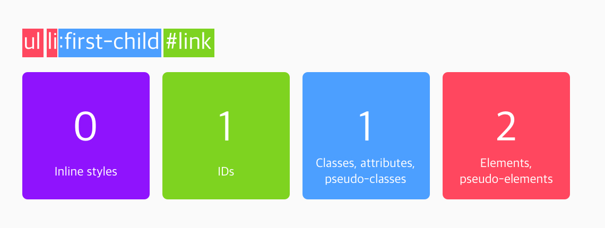

# CSS 우선순위

[TOC]

다양한 선택자를 배워봤습니다. 그런데 여러 선택자가 같은 요소를 가리키면 우선 순위를 어떻게 평가할까요?

## 순서

우선 가장 간단한 겁니다. 완전 똑같은 선택자가 나중에 또 나오면, 이전에 나온 스타일을 덮어쓰게 됩니다.

<iframe height="265" style="width: 100%;" scrolling="no" title="080501" src="https://codepen.io/tiroring09/embed/LYpzozj?height=265&theme-id=default&default-tab=css,result" frameborder="no" allowtransparency="true" allowfullscreen="true" loading="lazy">
  See the Pen <a href='https://codepen.io/tiroring09/pen/LYpzozj'>080501</a> by tiroring09
  (<a href='https://codepen.io/tiroring09'>@tiroring09</a>) on <a href='https://codepen.io'>CodePen</a>.
</iframe>

## 명시도 (Specificity)

같은 요소를 가리키지만 선택자가 다르다면, '명시도(specificity)'에 따라 우선 순위가 결정됩니다.

### 명시도 계산기

명시도 계산 방법을 알려드리겠습니다.

- 인라인 스타일이 가장 우선 순위가 높습니다.
- 선택자에 id가 많을 수록 우선 순위가 높습니다.
- 선택자에 class, attribute, pseudo-class가 많을 수록 우선 순위가 높습니다.
- 그 다음은 그냥 요소(또는 가상 요소)가 많은 순서입니다.

`<ul>` 태그 안에 `<li>` 태그 안에 `<a id="link">`가 있다고 가정해봅시다. `<ul>`과 `<li>`는 나중에 배울 '리스트' 태그입니다.

첫 번째 경우에는 일반 요소가 세 개, 가상 클래스가 한 개 있어서 '명시도 점수'가 13입니다. 두 번째 경우에는 일반 요소가 두 개, 가상 클래스가 한 개, 그리고 id가 한 개 있어서 112점입니다.

따라서 두 선택자에서 겹치는 스타일이 있는 경우, 두 번째 경우인 ul li:first-child #link 선택자의 스타일이 적용되는 거죠!

<iframe height="265" style="width: 100%;" scrolling="no" title="080502" src="https://codepen.io/tiroring09/embed/abvLrEp?height=265&theme-id=default&default-tab=html,result" frameborder="no" allowtransparency="true" allowfullscreen="true" loading="lazy">
  See the Pen <a href='https://codepen.io/tiroring09/pen/abvLrEp'>080502</a> by tiroring09
  (<a href='https://codepen.io/tiroring09'>@tiroring09</a>) on <a href='https://codepen.io'>CodePen</a>.
</iframe>